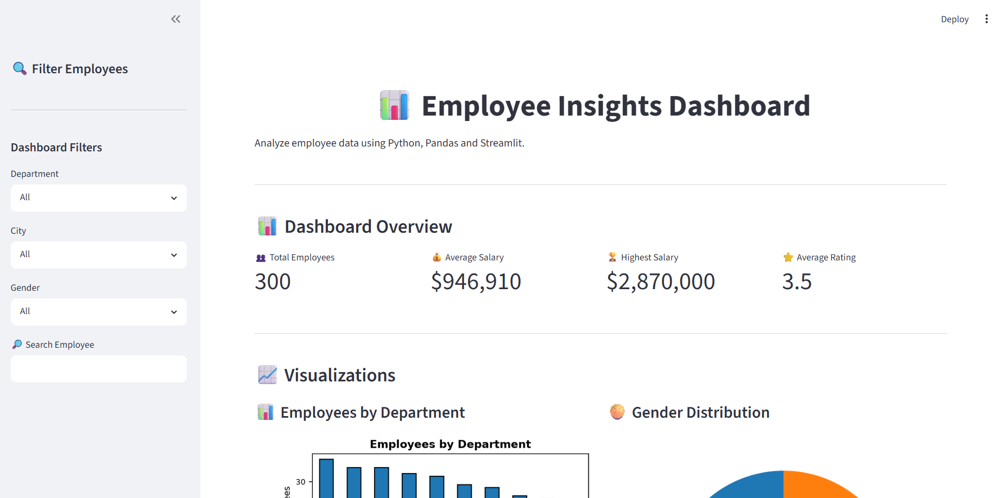
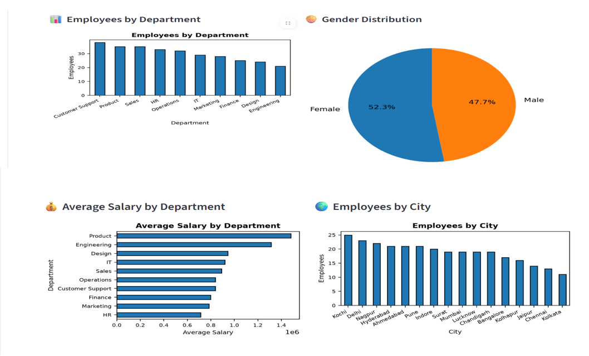
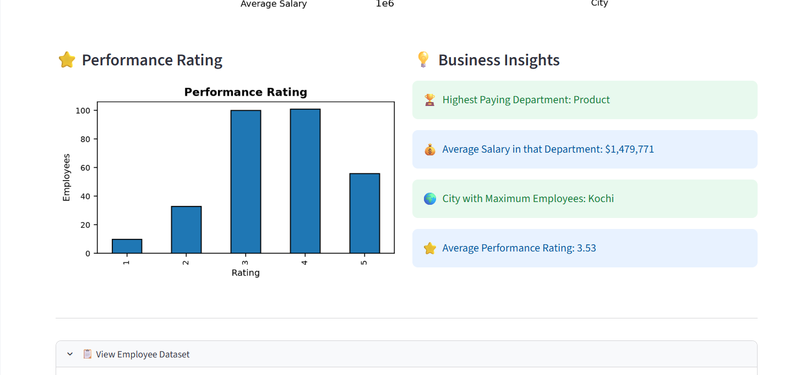
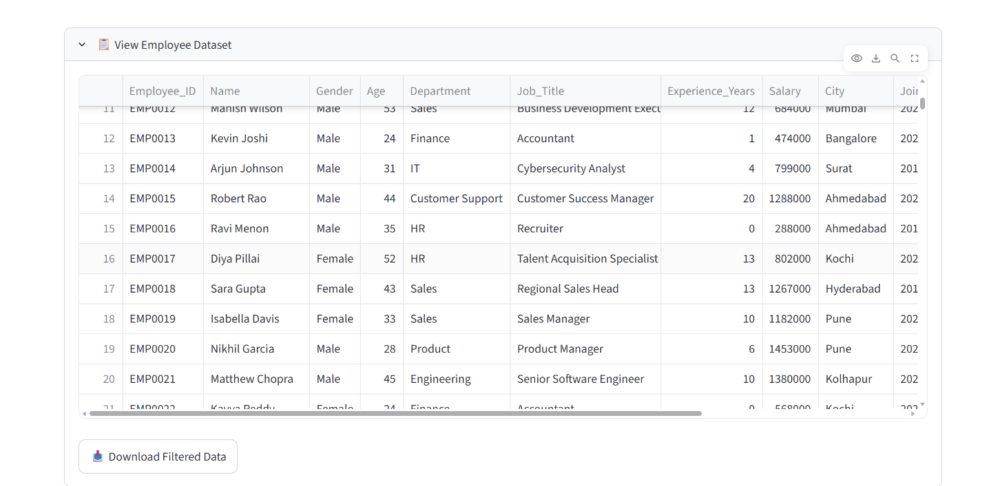

# 📊 Employee Insights Dashboard

## 📌 Project Overview

The Employee Insights Dashboard is an interactive data analysis application built using Python, Pandas, Matplotlib, and Streamlit. It helps users analyze employee data through KPI metrics, filters, charts, and business insights.

---

## 🎯 Objective

The objective of this project is to demonstrate how Python can be used for data analysis by transforming raw employee data into meaningful insights using interactive dashboards and visualizations.

---

## ✨ Features

- 📊 Dashboard Overview with KPI Cards
- HTML & CSS (for custom dashboard styling)
- 🔍 Filter Employees by Department, City, and Gender
- 🔎 Search Employee by Name
- 📋 Interactive Employee Data Table
- 📥 Download Filtered Data as CSV
- 📈 Employees by Department (Bar Chart)
- 🥧 Gender Distribution (Pie Chart)
- 💰 Salary Distribution (Histogram)
- 🌍 Employees by City (Bar Chart)
- ⭐ Performance Rating Analysis
- 💡 Business Insights


---

## 🛠 Technologies Used

- Python
- Pandas
- Streamlit
- Matplotlib
- HTML & CSS (for custom dashboard styling)

---

## 📂 Dataset

The dashboard uses an employee dataset containing information such as:

- Employee Name
- Department
- City
- Gender
- Salary
- Performance Rating

---

## 🚀 How to Run

1. Clone the repository

2. Install the required libraries

```bash
pip install -r requirements.txt
```

3. Run the application

```bash
streamlit run app.py
```

---

## 📚 Learning Outcomes

Through this project, I learned:

- Data Analysis using Pandas
- Data Visualization using Matplotlib
- Interactive Dashboard Development using Streamlit
- Data Filtering and Searching
- Business Insight Generation
- CSV Data Handling
- Streamlit UI Customization using CSS
---
## 📷 Dashboard Preview

### Dashboard Overview


### Visualizations


### Business Insights


### Employee Dataset


## 👨‍💻 Developed By

**Abdul Farooque Waseem**
